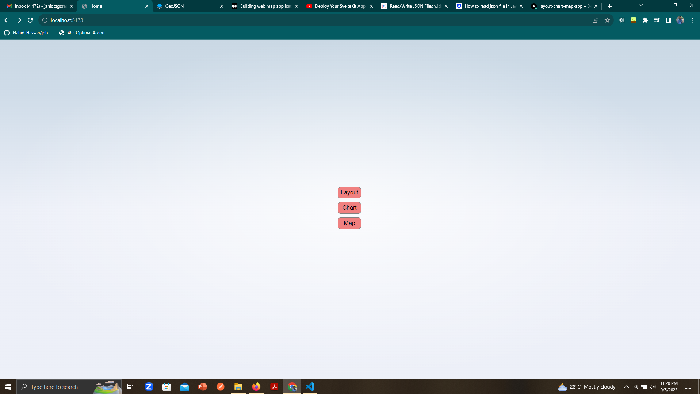
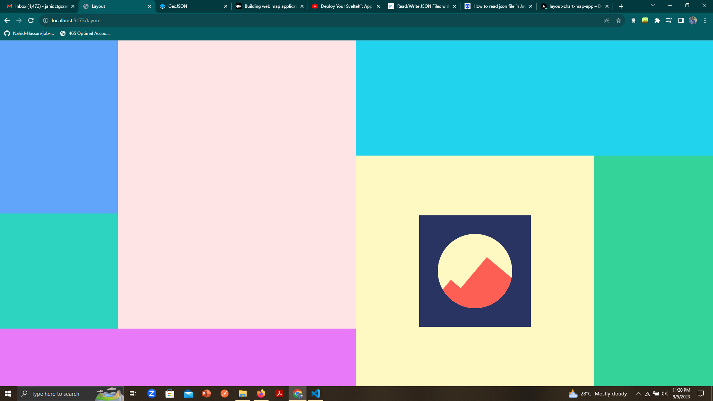
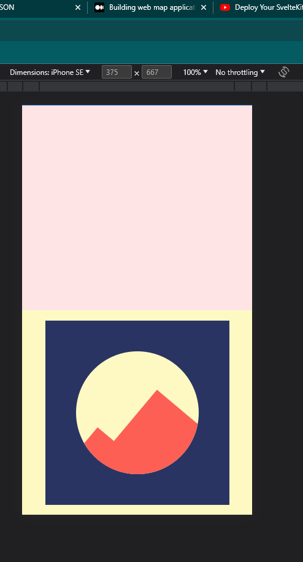
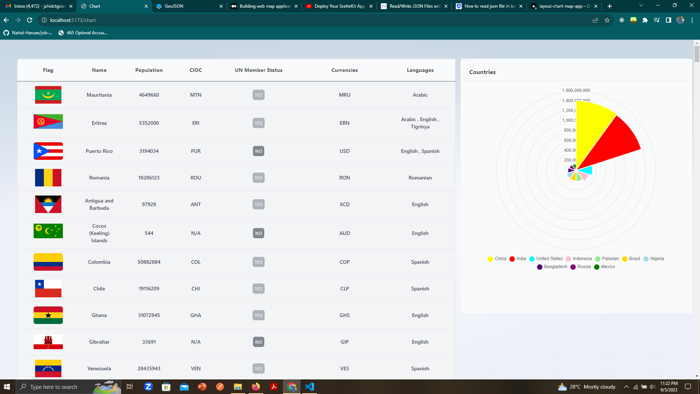
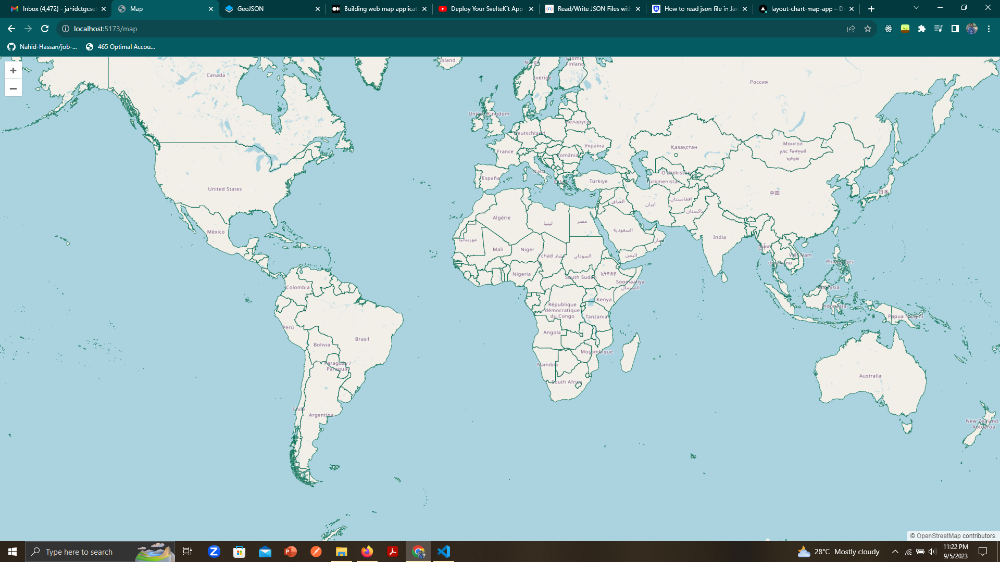

# Live

## link

Go to the [https://layout-chart-map-app.vercel.app/](https://layout-chart-map-app.vercel.app/) to see the project live.

# Run code Locally

## Download the source code

In order to run the project in the local environment you should download the source code or you could copy the "url" and use the following command

```bash
#clone the project
git clone url
```

## Developing

Once you've downloaded the project and installed dependencies with `npm install` (or `pnpm install` or `yarn`), start a development server:

```bash
npm run dev
```

## Building

To create a production version of your app:

```bash
npm run build
```

## Screenshots

### Home Page



### Layout Page



### Layout Page(Mobile View)



### Chart Page



### Map Page


